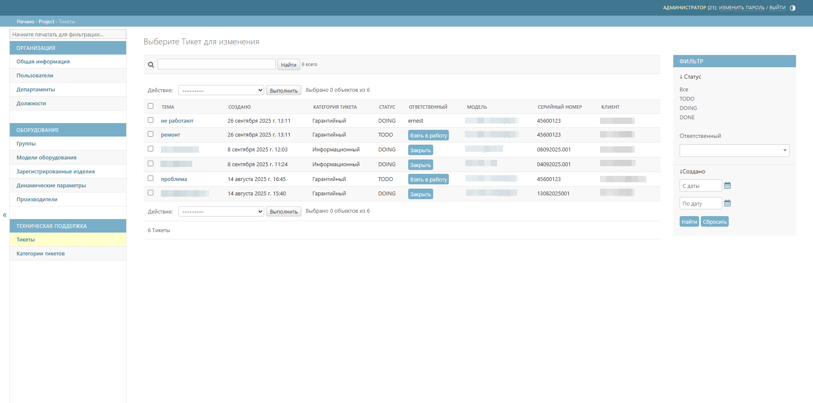

# Тикеты
Подраздел **Тикеты** содержит все обращения от пользователей. Позволяет отслеживать статусы заявок и просматривать всю историю сообщений.

## Описание главного окна

Таблица тикетов содержит следующие колонки:

* _тема_ – краткое описание проблемы;
* _создано_ – дата и время создания обращения;
* _категория тикета_ — тип запроса;



Для удобства работы с тикетами сначала создайте [категории тикетов](ticket_categories.md#anchor).



* _статус_ – текущее состояние обработки (TODO, DOING, DONE);

* _ответственный_ – специалист, назначенный для работы с обращением;
* _модель_ – модель изделия, к которой относится обращение;
* _серийный номер_ – идентификатор изделия;
* _клиент_ – контактные данные отправителя обращения (электронная почта или номер телефона).

## Статусы тикета
* _TODO_ – новый тикет, ожидает назначения ответственного и начала работы;

* _DOING_ – тикет взят в работу, над обращением ведётся активная деятельность;

* _DONE_ – тикет закрыт, вопрос решён.

