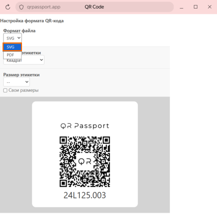
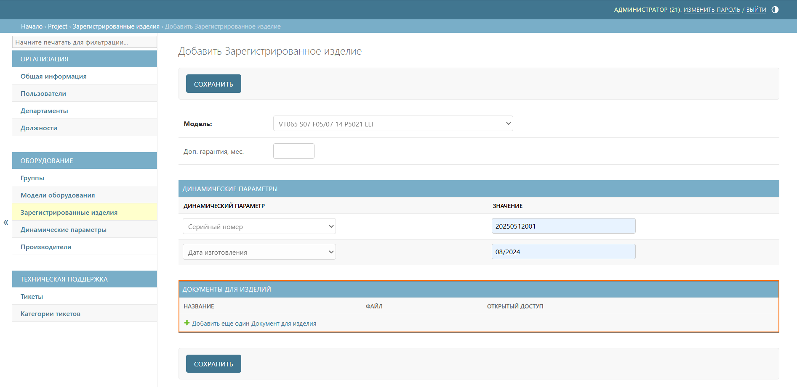

# История изменений
## Декабрь 2025
### _QR-коды в векторном формате SVG_

Добавлена возможность выбора формата файла при [скачивании QR-кода](equipment/registered_products.md#skachivanie-qr-koda/qr-kodov). Это позволяет использовать QR-коды не только для печати на принтерах, но и в производственных процессах, где требуется векторная графика – например, для нанесения на оборудование методами лазерной гравировки или фрезеровки.

{width=400 height=400}

## Сентябрь 2025
### _Документы для изделий_

Добавлена возможность прикрепления документов к изделию при его [регистрации](equipment/models.md#registraciya-izdeliya). Это позволяет при сканировании QR-кода отображать не только общие документы модели, но и индивидуальные документы, загруженные для конкретного экземпляра изделия.

